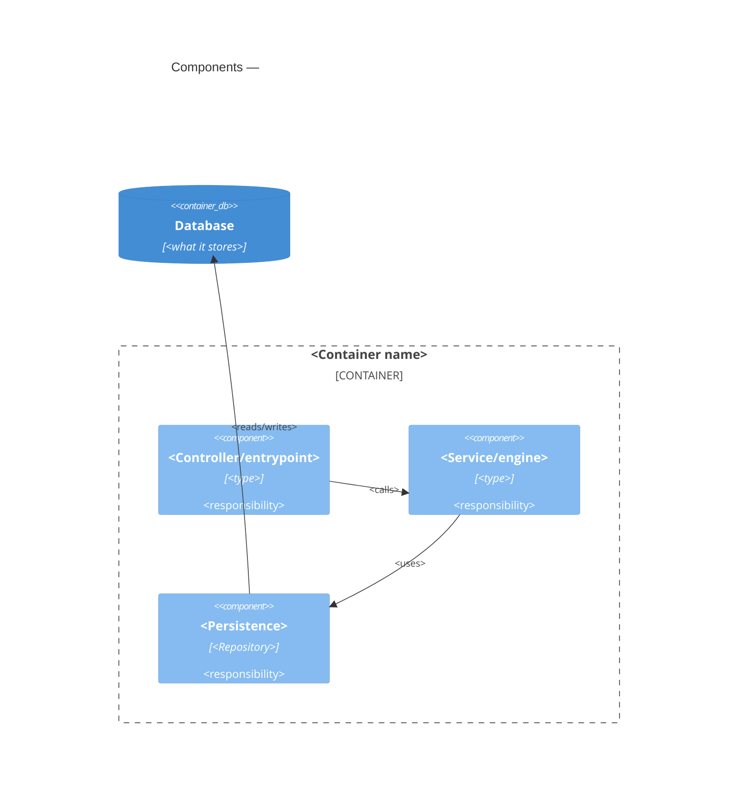

# C4 — Component diagram: `<container name>`

> **AI-DLC phase:** `02-design`  ·  Level 3 (components inside a container).

```mermaid
C4Component
    title Components — <Container name>

    Container_Boundary(api, "<Container name>") {
        Component(ctrl, "<Controller/entrypoint>", "<type>", "<responsibility>")
        Component(svc, "<Service/engine>", "<type>", "<responsibility>")
        Component(repo, "<Persistence>", "<Repository>", "<responsibility>")
    }

    ContainerDb(db, "Database", "<what it stores>")

    Rel(ctrl, svc, "<calls>")
    Rel(svc, repo, "<uses>")
    Rel(repo, db, "<reads/writes>")
```

## Rules / behavior
1. `<the key rules this component enforces>`
