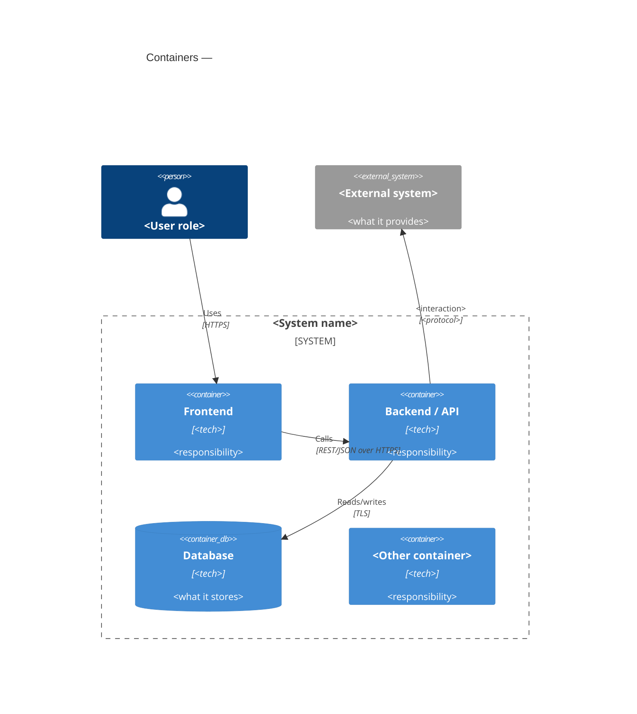

# C4 — Container diagram

> **AI-DLC phase:** `02-design`  ·  Level 2 (containers inside the system).

```mermaid
C4Container
    title Containers — <System name>

    Person(user, "<User role>")

    System_Boundary(sys, "<System name>") {
        Container(web, "Frontend", "<tech>", "<responsibility>")
        Container(api, "Backend / API", "<tech>", "<responsibility>")
        ContainerDb(db, "Database", "<tech>", "<what it stores>")
        Container(other, "<Other container>", "<tech>", "<responsibility>")
    }

    System_Ext(ext, "<External system>", "<what it provides>")

    Rel(user, web, "Uses", "HTTPS")
    Rel(web, api, "Calls", "REST/JSON over HTTPS")
    Rel(api, db, "Reads/writes", "TLS")
    Rel(api, ext, "<interaction>", "<protocol>")
```

**Notes**
- `<encryption, boundaries, statelessness, etc.>`
