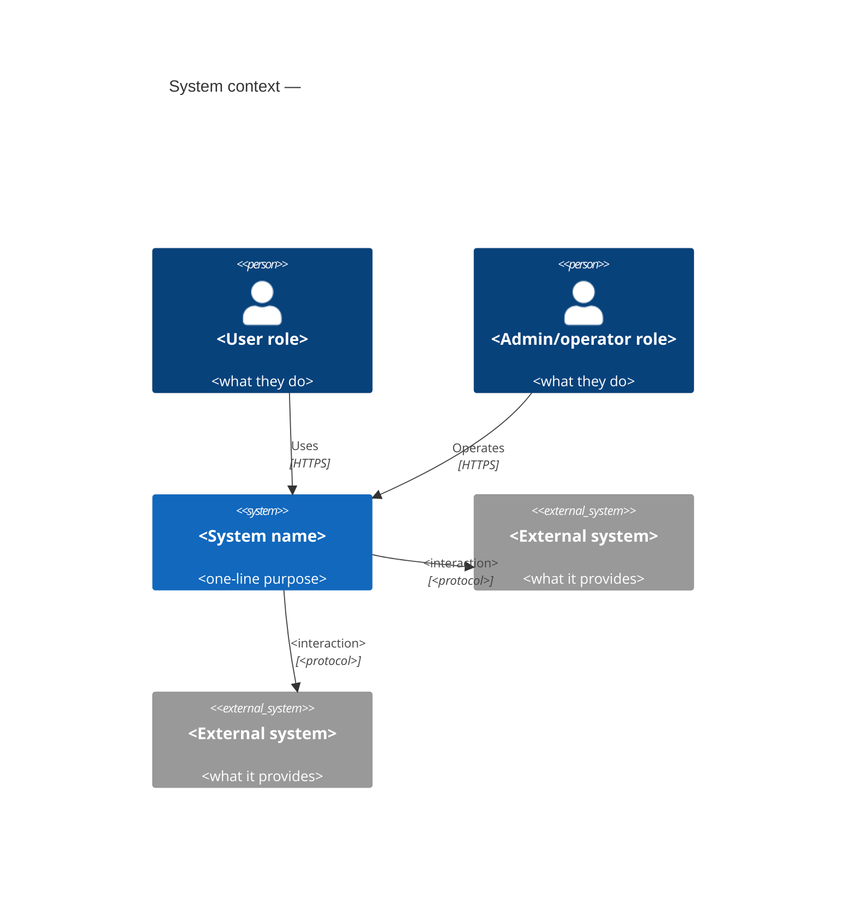

# C4 — Context diagram

> **AI-DLC phase:** `02-design`  ·  Level 1 (the system in its environment).

```mermaid
C4Context
    title System context — <System name>

    Person(user, "<User role>", "<what they do>")
    Person(admin, "<Admin/operator role>", "<what they do>")

    System(sys, "<System name>", "<one-line purpose>")

    System_Ext(ext1, "<External system>", "<what it provides>")
    System_Ext(ext2, "<External system>", "<what it provides>")

    Rel(user, sys, "Uses", "HTTPS")
    Rel(admin, sys, "Operates", "HTTPS")
    Rel(sys, ext1, "<interaction>", "<protocol>")
    Rel(sys, ext2, "<interaction>", "<protocol>")
```

**Notes**
- `<any non-obvious relationship or boundary>`
